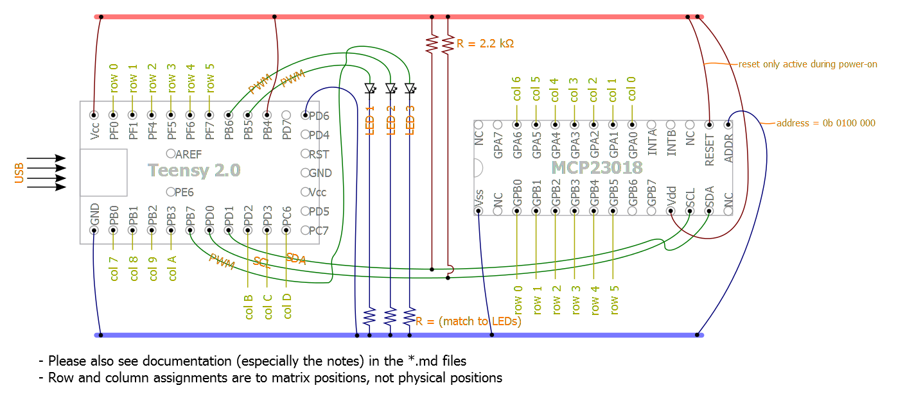
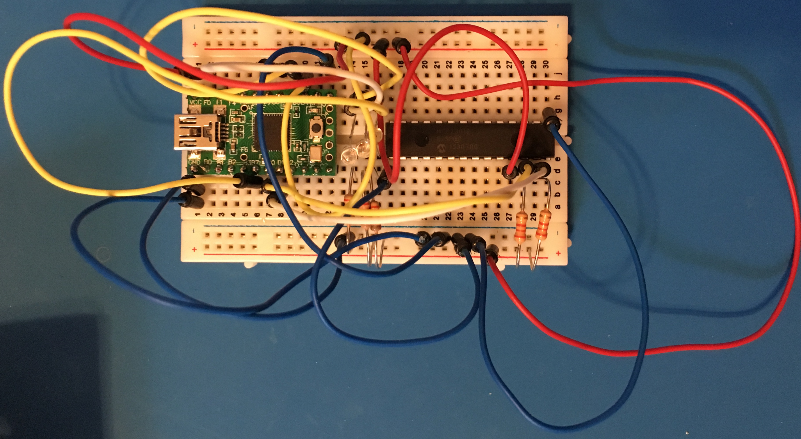
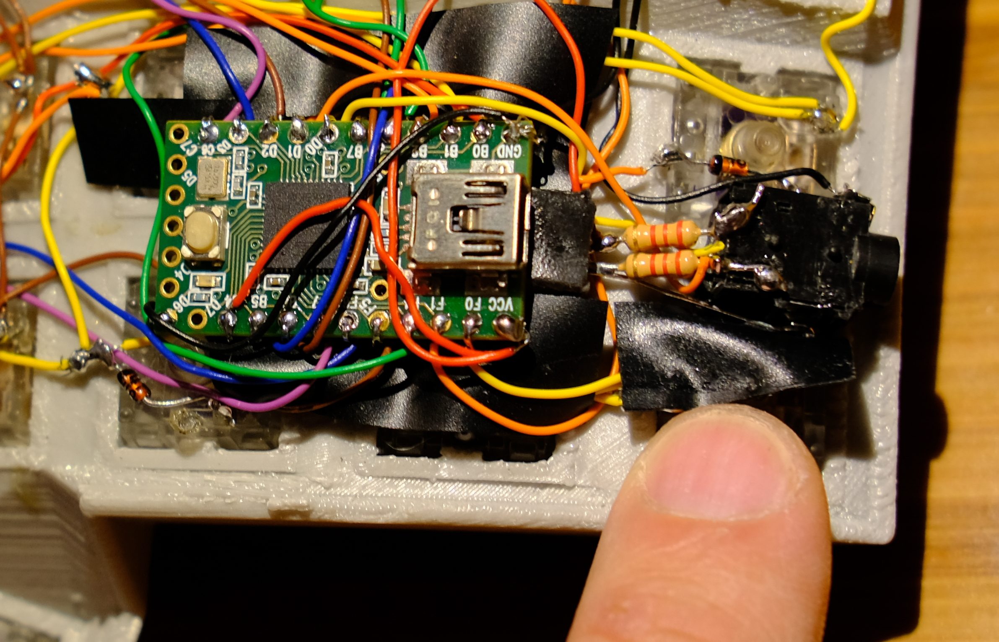
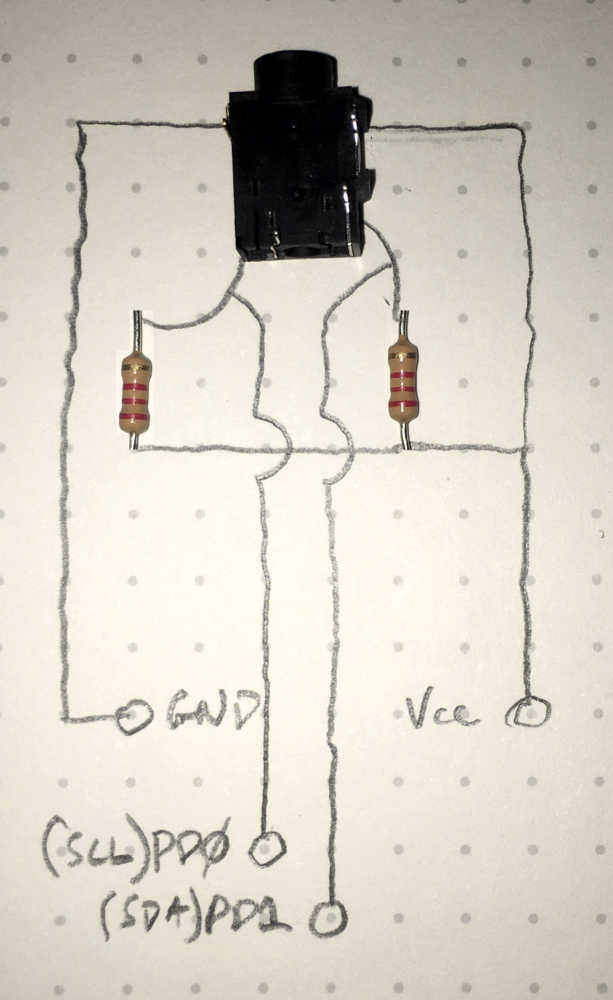

# The EZ Way to QMK

Do you love your Kinesis Advantage, but also love your Ergodox-EZ? Now you can
have the best of both worlds with your very own QMK running Dactyl! Feels like a
Kinesis, works like an Ergodox-EZ.

I found this [Massdrop guide](massdrop-ergodox-build-guide.pdf) that shipped with their original
Ergodox to be very helpful.

## Shopping List

### Things you'll have to find yourself:

* Case
* 70x Cherry MX compatible Switches
* 6x Cherry ML switches (optional)


### Things you can order from Digikey

#### An aside on LEDs

Before you place this order, you'll need to figure out what color you want your
LEDs to be, or if you even want LEDs at all.

I had a terrible time figuring out how to figure out which resistor to use with
each LED. All I can attest to is that
[These Orange LEDs](http://www.maxkeyboard.com/max-keyboard-orange-3mm-flangeless-replacement-led-for-backlit-mechanical-keyboard-10-pcs.html)
work with
[These 220Ω resistors](http://www.digikey.com/scripts/DkSearch/dksus.dll?Detail&itemSeq=229354283&uq=636318134508631803)
or at least have yet to fail in my Dactyl.

I was hoping that I could find these LEDs on Digikey for you, but they don't
have ones with the exact specs and I don't know if that breaks the compatibility
with the resistors I found.

Here's
[the evil mad scientist's guide](http://www.evilmadscientist.com/2012/resistors-for-leds/)
to choosing resistors for LEDs, but every time I did the math, it didn't work
out.

Seriously, find someone who knows more about this if you're making decisions
here. You're probably already more qualified than me, so open a PR and fix this
session.

* 70x [1N4148 Diodes](http://www.digikey.com/scripts/DkSearch/dksus.dll?Detail&itemSeq=229354375&uq=636318149504319926)
* 2x [2.2kΩ Pull up Resistors](https://www.digikey.com/product-detail/en/CFR-25JB-52-2K2/2.2KQBK-ND/666)
* 2x [TRRS Jacks](http://www.digikey.com/scripts/DkSearch/dksus.dll?Detail&itemSeq=229354247&uq=636318148338283334)
* 1 [Teensy 2.0](https://www.digikey.com/product-detail/en/adafruit-industries-llc/199/1528-1993-ND/6827126)
* 1 [MCP23018 I/O Expander](https://www.digikey.com/product-detail/en/microchip-technology/MCP23018-E-SP/MCP23018-E-SP-ND/1999505)
* [28 Pin IC Socket](http://www.digikey.com/scripts/DkSearch/dksus.dll?Detail&itemSeq=229356912&uq=636318143621851738)

If you want everything in this list from [Digikey](https://www.digikey.com), you
can upload [this cart](digikey-shopping-cart.csv).

### Things From Amazon

* 1x [MiniUSB Extender Cable](https://www.amazon.com/gp/product/B00B5HSA3Q)
* Solder/Electrical Tape/Twosided tape
* [30AWG wrapping wire](https://www.amazon.com/gp/product/B00GWFECWO)
* TRRS Cable [this one](https://www.amazon.com/Coiled-3-5mm-Jack-Audio-Cable/dp/B019TRW4HQ)
  worked for me, but it's a matter of taste and how much distance you need.

## Wiring up the Matrix

The firmware you choose will determine the wiring of the keyboard. Since the
Ergodox-EZ isn't going anywhere **AND** has first class support in QMK by its
creator, it makes pretty good sense to wire it up the same way.

Here's what the matrix code for the Ergodox-EZ in QMK looks like:

```c
// matrix positions
{   // MCP23018
 { k00, k10, k20,   k30, k40,   KC_NO },                     \
 { k01, k11, k21,   k31, k41,   k51   },                     \
 { k02, k12, k22,   k32, k42,   k52   },                     \
 { k03, k13, k23,   k33, k43,   k53   },                     \
 { k04, k14, k24,   k34, k44,   k54   },                     \
 { k05, k15, k25,   k35, KC_NO, k55   },                     \
 { k06, k16, KC_NO, k36, KC_NO, k56   },                     \
    // Teensy
 { k07, k17, KC_NO, k37, KC_NO, k57   },                     \
 { k08, k18, k28,   k38, KC_NO, k58   },                     \
 { k09, k19, k29,   k39, k49,   k59   },                     \
 { k0A, k1A, k2A,   k3A, k4A,   k5A   },                     \
 { k0B, k1B, k2B,   k3B, k4B,   k5B   },                     \
 { k0C, k1C, k2C,   k3C, k4C,   k5C   },                     \
 { k0D, k1D, k2D,   k3D, k4D,   KC_NO }                      \
}
```

This is a software mapping of 14 rows, even though the physical layout will wind
up with 14 columns. Physically, it looks like this:


Look at those colors, they'll be consistent throughout this documentation,
including the physical wire we wire it up with.

### Rows

You don't have to decide how to connect the rows to the Teensy or MCP yet. Just
worry about getting the matrix right.

Wiring rows 0-4 is easy. With the 30AWG wire, I had to cut individual wire
segments from switch to switch. The thumb clusters are Row 5 on each side, so
the same approach will work, it just doesn't look like a row.

Row 5 is the thumb cluster, so just wire them together and imagine they're in a
row instead of it being more like a circle.

The rows are just wire. Individual segments connecting two switches. I used a
pair of pointy tweezers to put little hooks on the end of each segment. The idea
is to let the Solder do most of the work. If a day ever comes where you have to
desolder one of these, you'll be glad you didn't aggressively wrap it.

### Columns

The columns need to be wired with diodes. You can probably wire the entire
column with the diode stems, but I chose to add some wire segments so it would
look clearer for this guide.


The diodes need the black bar facing away from the key. The other guides
disagree, but they don't use QMK.

To use wire segments here, I soldered the end of the diode with the black bar to
the wire first, then placed the other stem on the switch, positioned the diode
where I wanted it and then bet the diode stem into a hook around the switch
terminal.

I also made a habit of keeping the trimmed diode stems to use as bridges if
needed later.

**Note:** Column 6 only has one key at this point.

### Ergodox Compatibility Inner Columns

**This is an optional step, and can be done as a mod after you're done** so
there's no pressure to make this decision now.

Ergodoxes have an additional three keys in columns 6 & 7. Do you want them on
your Dactyl?

I own an Ergodox-EZ as well, and want to use the same keymap for both. So I
added the extra switches below the thumb clusters as Cherry ML switches. If you
don't care about a consistent experience between a Dactyl and Ergodox, or even
if you do, it's a matter of personal preference.

Wherever you put them, they're wired into rows 0,1 and 3. Either way, you need
to wire columns 6 and 7 to the top inner most key in the thumb cluster, so
columns 6 & 7 are going to be live.

If you go with MLs, you can put them wherever you want, but be careful measuring
where the holes go, you only get one shot.

**TODO:** CherryML switch hole specs.

## The Matrix Has You

Actually, you have it! Congratulations on having gotten this far.

## Wiring The Right Half

### Wiring the Teensy

We have to start off with the obligatory wiring diagram



Notice the row numbers are different from the other guides to match the QMK
key codes we're using.

I started off by breadboarding this whole project, but I also burnt out the
teensy's bootloader.
[My misadventures wiring a Dactyl](http://joedevivo.com/2017/05/20/building-a-qmk-dactyl.html)
are a fun read if you feel like this is too hard. I've been there.

Here's the pinout mappings for the rows and columns:

| Row     | Wire Color | Teensy Pin |
|---------|------------|------------|
| 0       | Yellow     | PF0        |
| 1       | Orange     | PF1        |
| 2       | Green      | PF4        |
| 3       | Brown      | PF5        |
| 4       | Blue       | PF6        |
| 5       | Purple     | PF7        |


| Column | Wire Color | Teensy Pin |
|--------|------------|------------|
| 7      | Red        | PB0        |
| 8      | Yellow     | PB1        |
| 9      | Orange     | PB2        |
| A      | Green      | PB3        |
| B      | Brown      | PD2        |
| C      | Blue       | PD3        |
| D      | Purple     | PC6        |

Wiring the teensy involves looping the 30AWG wire through the Teensy's pinouts,
I went through twice, and then dabbed a little solder. If you are ok with
possibly wasting a little wire, you can use longer wire to solder up the Teensy
and then breadboard with those wires. There's no room for pins in the case, so
this is the best way to test it out.

Here's my breadboarded version, almost done. (missing the reset wire to the MCP
in this photo)



Yours will look similar, but with the Teensy coming from off board with a bunch
of wires. You don't have to breadboard the columns and rows for the teensy, you
can test them by clipping them to the right spot on the matrix you built.

Columns and rows run by the MCP (Greetings, program!) will be accessible via the
breadboard.

Here's what that looks like wired in.


Fortunately, QMK *will* let you just run the right half, so you can check in at
this point and see how that all works,

### The TRRS Jack

In an effort to move some of the bulk away from the Teensy, I put the pull up
resistors as close to the jack as I could.



I wired the two 2.2k resistors to the bottom two terminals on the TRRS jack,
then wired the SCL(PD0) and SDA(PD1) to the resistor leg going into the jack.
Then soldered the outside legs together and ran a wire from Vcc to those outside
legs, and from them to a third terminal on the TRRS jack. Now all you need is to
run GND to the fourth terminal.



## Wiring The Left Half

### Wiring the I/O Expander
